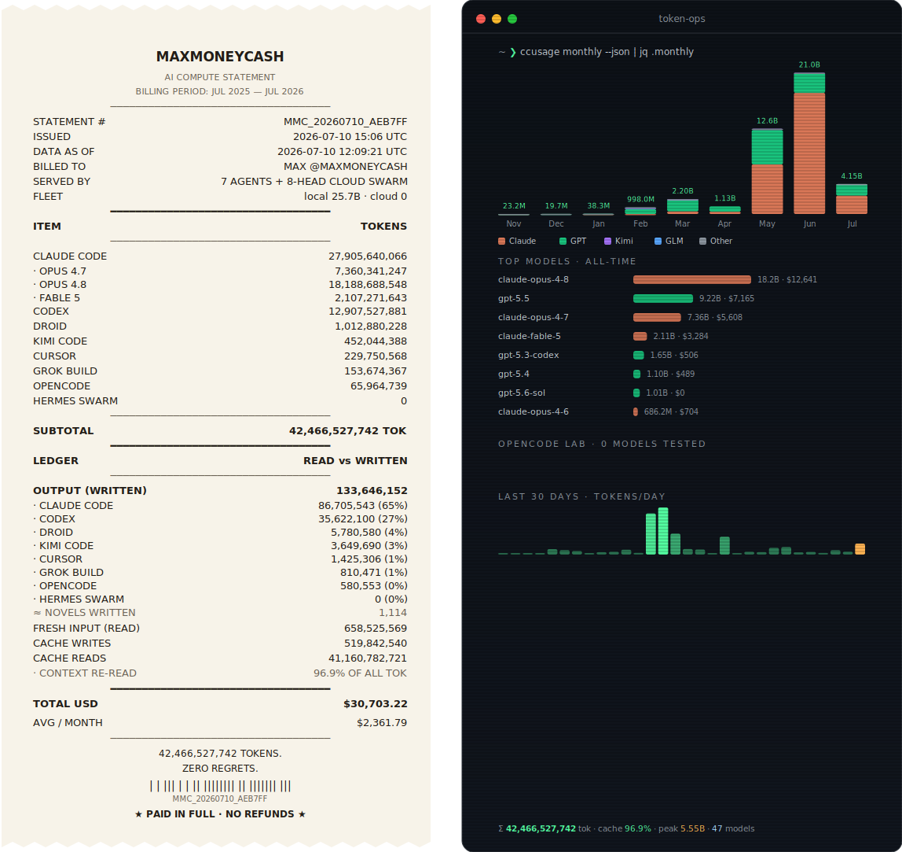
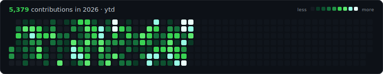
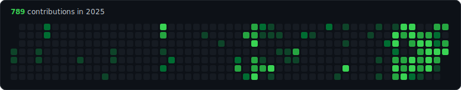
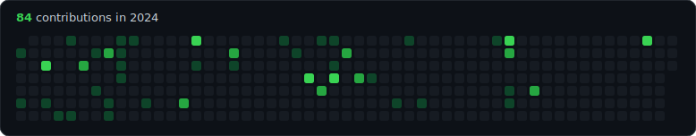
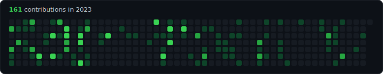
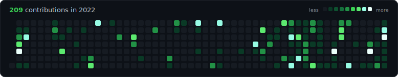
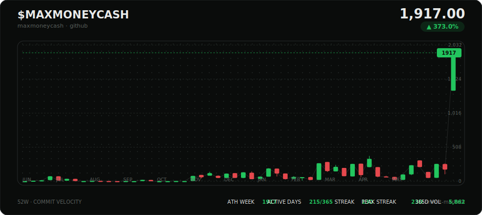
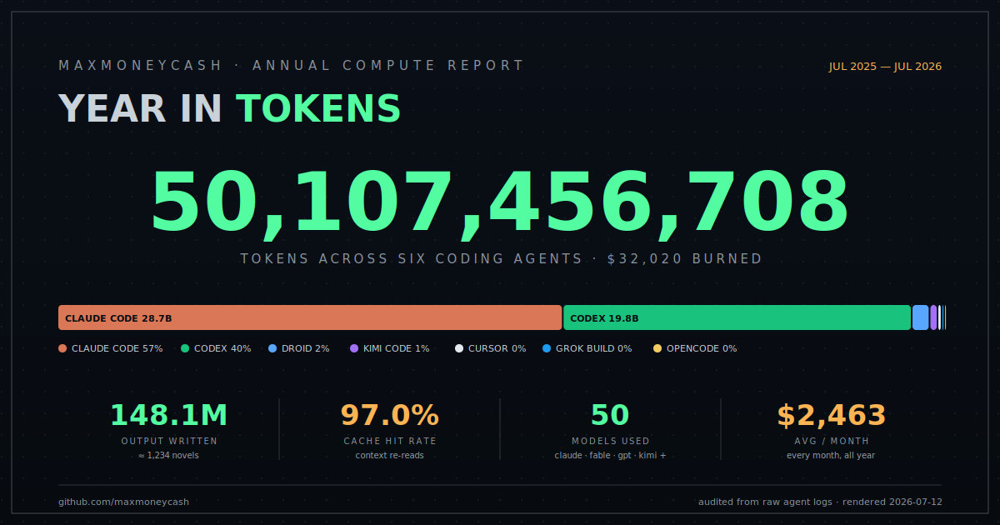

 

## <samp>~ ❯ ccusage --all-time</samp>

Live token telemetry across <b>Claude Code · Codex · Cursor · Grok Build · Kimi Code · OpenCode · Droid</b> — pushed daily from my Mac (launchd → <a href="https://github.com/ryoppippi/ccusage">ccusage</a> + custom counters) and rendered by GitHub Actions.

  

<picture>
<source media="(max-width: 768px)" srcset="https://raw.githubusercontent.com/maxmoneycash/maxmoneycash/main/assets/tokens-stack.svg"/>

</picture>

## <samp>~ ❯ git log --graph --all</samp>

## <samp>~ ❯ gh contrib --terminal</samp>

## <samp>~ ❯ wrapped --share</samp>

<samp><a href="https://raw.githubusercontent.com/maxmoneycash/maxmoneycash/main/assets/wrapped.png">download PNG for posting →</a></samp>

 

<samp>rendered daily · cards by GitHub Actions · token data via launchd + ccusage on my mac · org work lives at <a href="https://github.com/seammoney">@seammoney</a></samp>

