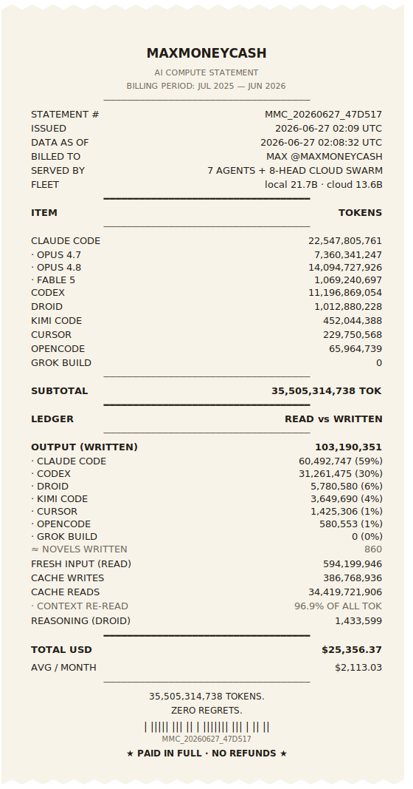
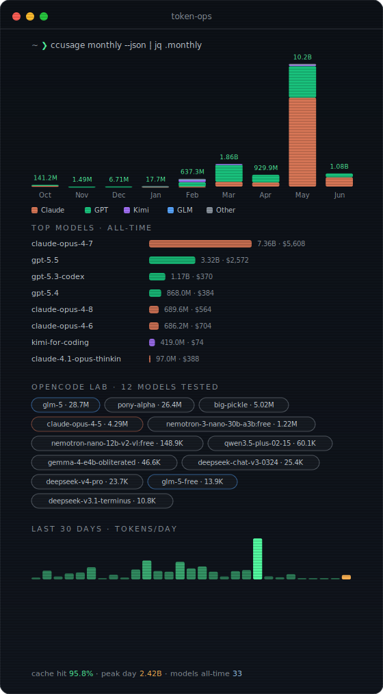
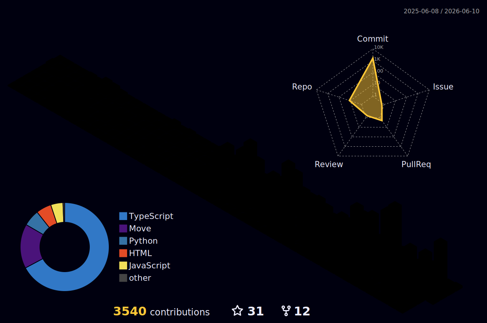
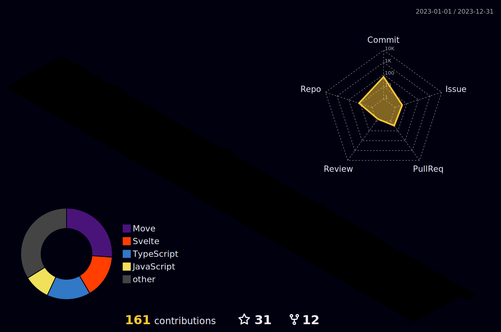
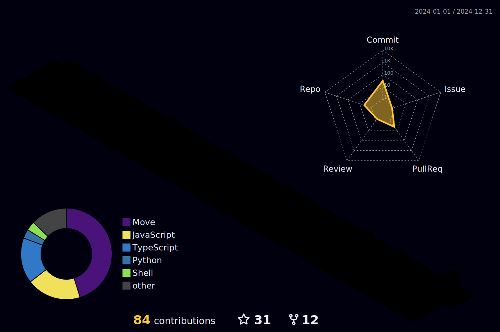
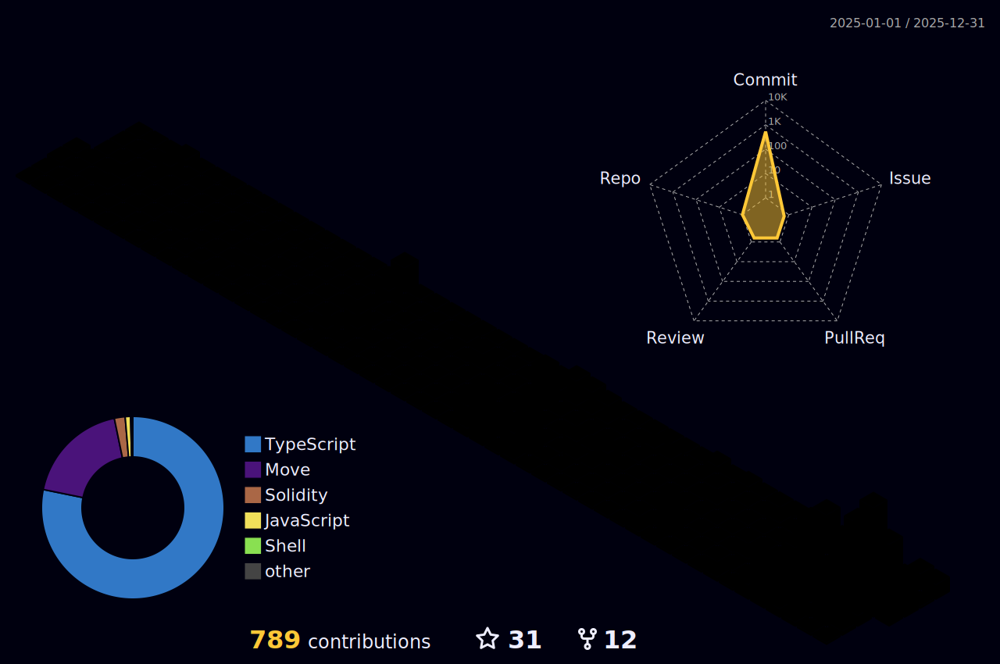

 

## <samp>~ ❯ ccusage --all-time</samp>

Live token telemetry across <b>Claude Code · Codex · Kimi Code · OpenCode · Droid</b> — pushed daily from my Mac (launchd → <a href="https://github.com/ryoppippi/ccusage">ccusage</a>) and rendered by GitHub Actions. Grok Build runs untracked: its CLI keeps no local token accounting.

  

<table>
<tr>
<td width="42%" align="center" valign="top"></td>
<td width="58%" align="center" valign="top"></td>
</tr>
</table>

## <samp>~ ❯ git log --graph --all</samp>

<table align="center" width="100%">
<tr><td colspan="3" align="center">
<picture>
<source media="(prefers-color-scheme: dark)" srcset="https://raw.githubusercontent.com/maxmoneycash/maxmoneycash/output/github-contribution-grid-snake-dark.svg"/>
<source media="(prefers-color-scheme: light)" srcset="https://raw.githubusercontent.com/maxmoneycash/maxmoneycash/output/github-contribution-grid-snake.svg"/>

</picture>

<b>live (rolling 365 days)</b>

</td></tr>
<tr>
<td width="33%" align="center">
<b>2023</b>
</td>
<td width="33%" align="center">
<b>2024</b>
</td>
<td width="33%" align="center">
<b>2025</b>
</td>
</tr>
</table>

## <samp>~ ❯ gh contrib --3d</samp>

<table align="center" width="100%">
<tr><td colspan="3" align="center">

<b>live (rolling 365 days)</b>

</td></tr>
<tr>
<td width="33%" align="center">
<b>2023</b>
</td>
<td width="33%" align="center">
<b>2024</b>
</td>
<td width="33%" align="center">
<b>2025</b>
</td>
</tr>
</table>

 

<samp>rendered daily · cards by GitHub Actions · token data via launchd + ccusage on my mac · org work lives at <a href="https://github.com/seammoney">@seammoney</a></samp>

